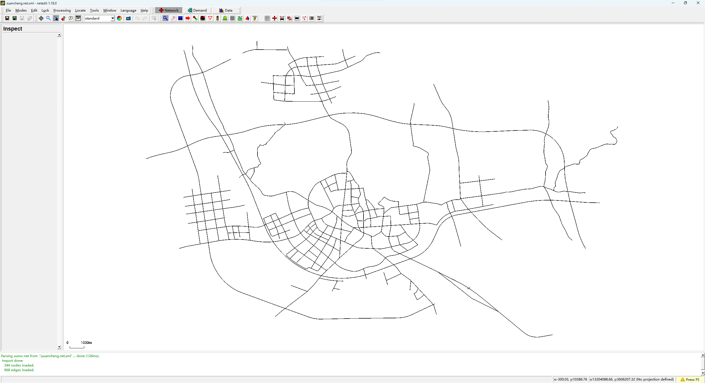

# 说明

该仓库中的数据和路网是基于 [City-scale synthetic individual-level vehicle trip data](https://springernature.figshare.com/collections/City-Scale_Synthetic_Individual-level_Vehicle_Trip_Data/6148536/1) 的路网和数据生成的。提供了 PostgreSQL (+PostGIS) 数据库导入代码，方便查看相关数据。同时基于原数据提供了 SUMO 路网和交通流量，方便开展仿真等研究。当你使用该仓库中的数据和路网时，请务必引用原工作：

```latex
@article{li2023city,
  title={City-scale synthetic individual-level vehicle trip data},
  author={Li, Guilong and Chen, Yixian and Wang, Yimin and Nie, Peilin and Yu, Zhi and He, Zhaocheng},
  journal={Scientific Data},
  volume={10},
  number={1},
  pages={96},
  year={2023},
  publisher={Nature Publishing Group UK London}
}
```

ℹ️ 如果你只是想用该数据做 SUMO 仿真，可以直接复制 `./sumo/simulationFiles/` 这个文件夹到你的工作目录。里面有路网文件 `.net.xml` 和路径文件 `.rou.xml`，直接使用，下面的使用手册就不需要看了。

ℹ️ 注意，`./sumo/simulationFiles/xuancheng.net.xml` 的 `location` 信息有缺失，直接运行 `sumo-gui -n xuancheng.net.xml` 视角不会聚焦在路网上，因此需要设置手动设置 view，比如可以这样运行 `sumo-gui -n xuancheng.net.xml -g xuanchegn.settings.xml`，具体的使用方法请参考 [运行仿真](#运行仿真)。

ℹ️ [City-scale synthetic individual-level vehicle trip data](https://springernature.figshare.com/collections/City-Scale_Synthetic_Individual-level_Vehicle_Trip_Data/6148536/1) 提供了数天的出行数据，我无法将所有的交通流都生成，只挑选了流量最大的三个小时生成了 route 文件，分别是 `xuancheng.rou.xml`，`xuancheng-1.rou.xml` 和 `xuancheng-2.rou.xml`。

# 使用手册

本仓库主要将 `City-scale synthetic individual-level vehicle trip data` 中的路网和数据转化为 PostgreSQL 数据库和 SUMO 仿真。该仓库不提供原数据，请点击[链接](https://springernature.figshare.com/collections/City-Scale_Synthetic_Individual-level_Vehicle_Trip_Data/6148536/1)，自行下载。

## 获取原数据

原始数据为安徽省宣城市的路网和交通流量，路网可视化如下图所示：


下载原数据后，请在根目录下新建 `openits` 文件夹，然后将下载的数据如下排放，以方便后续的使用：

```txt
./
├──openits
│   ├── road_network
│   │   ├── topo_centerroad.cpg
│   │   ├── topo_centerroad.dbf
│   │   ├── topo_centerroad.prj
│   │   ├── topo_centerroad.qpj
│   │   ├── topo_centerroad.shp
│   │   └── topo_centerroad.shx
│   ├── The_synthetic_individual-level_trip_dataset.csv
│   └── zone_roads.csv
├── ...
└── readme.md
```

## 准备工作

在开始操作前，请确保已经安装了以下软件：

- [Python-3.11.3](https://www.python.org/)
- [SUMO-1.18.0](https://sumo.dlr.de/docs/index.html)
- [PostgreSQL-15.3](https://www.postgresql.org/)
- [PostGIS-3.3.3](https://postgis.net/)

更老的版本或许也行，但是我没有尝试过。

同时，请安装以下 Python 包：

- [psycopg3](https://www.psycopg.org/psycopg3/docs/basic/install.html)
- rich
- pyaml

## 导入 PostgreSQL 数据库

首先要新建数据库，并创建 postgis 插件。这里建议将数据库名称定义为 `OPENITS`，方便后续的使用。

```sql
CREATE DATABASE OPENITS;
CREATE EXTENSION postgis;
```

然后将 `./openits/road_network/topo_centerroad.shp` 文件导入到数据库中。这里直接使用 postgis 工具，总共需要三个步骤。

- Step 1: 配置数据库连接，数据库名称必须与上一步创建的数据库名称一致；
- Step 2: 选择 shapefile 文件；
- Step 3: 导入文件。


导入完成后，数据库中会出现 `topo_centerroad` 和 `spatial_ref_sys` 这两张表，也就完成了地理信息的导入。

然后需要导入流量数据，这里可以直接运行 `./posgresql/dataInsert.py` 来导入数据。

```powershell
cd postgresql
python dataInsert.py
```

按要求输入用户名和密码即可，或者你可以在根目录创建 `./databaseConfig.yaml` 来存储数据库信息：

```yaml
DATABASE : 'OPENITS'
HOST: '127.0.0.1'
USER: 'xxx'   # your username
PASSWORD: 'xxx'   # your password
PORT: '5432'
```

如果 `./posgresql/dataInsert.py` 成功被运行，则你会获得 `zone_roads` 和 `the_synthetic_individual_level_trip_dataset` 两张表。至此，原始数据已经完全导入到数据库中。

一些统计信息：

```sql
--查询每小时的出行流量信息
select date_trunc('hour', departure_time) as hours, count(*) as volume  
from the_synthetic_individual_level_trip_dataset
group by hours
order by hours;
```

## SUMO

ℹ️ 再次提醒，如果你只是想用该数据做 SUMO 仿真，可以直接复制 `./sumo/simulationFiles/` 这个文件夹到你的工作目录。里面有路网文件 `.net.xml` 和路径文件 `.rou.xml`，可以直接使用。使用方法参考 [运行仿真](#运行仿真)

如果想自己生成路网和交通流，请确保上述 PostgreSQL 数据库成功创建，并导入所有的数据。

### 生成路网

跳转到 `./sumo/` 文件夹，然后运行 `genNetwork.py` 即可，能够得到 `xuancheng.nod.xml` 、`xuancheng.edg.xml` 和 `xuancheng.net.xml` 三个文件。

```Powershell
cd sumo
python genNetwork.py
```

运行 `netedit xuancheng.net.xml` 可以查看路网。



### 生成路径

跳转到 `./sumo/` 文件夹，然后运行 `genRoute.py` 即可，能够得到 `xuancheng.rou.xml`。

```Powershell
cd sumo
python genRoute.py
```

这里你可以修改 `genRoute.py` 中的第 28 行来指定生成 route 文件的时间，以及持续的时间。

```Python
start_time = datetime.strptime('2019-08-12 17:00:00', '%Y-%m-%d %H:%M:%S')
end_time = start_time + timedelta(hours=1)
```

ℹ️ 原数据中有很多的路段之间实际上是没有连接的，因此最终生成的车辆数是小于原数据的 trip 数的。

### 运行仿真

前文已经提到，使用 `sumo-gui` 查看仿真，会由于视角偏移而无法显示路网。这个时候可以使用 `xuancheng.settings.xml` 来指定视角，下面是使用方法。

在命令行中使用：

```Powershell
sumo-gui -n .\xuancheng.net.xml -g .\xuancheng.settings.xml -r xuancheng.rou.xml
```

在 traci 中使用：

```Python
traci.start(
  [
    'sumo-gui', '-n', 'xuancheng.net.xml',
    '-r', 'xuancheng.rou.xml',
    '-g', 'xuancheng.settings.xml'
  ]
)
```